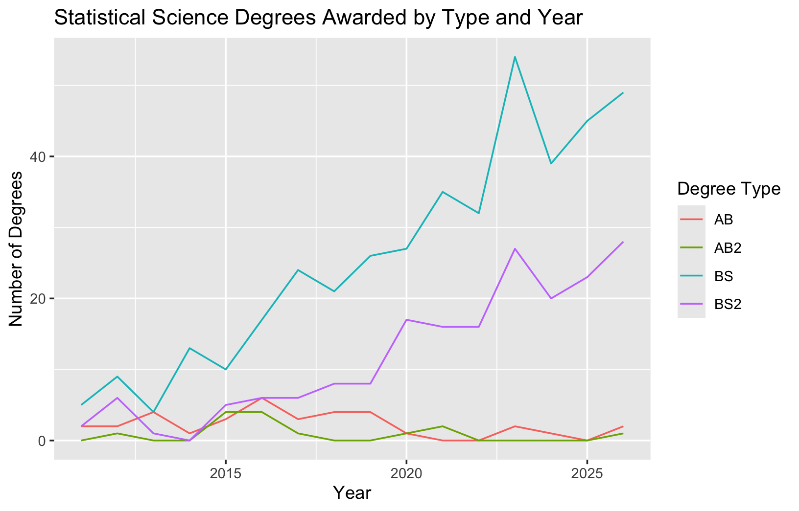
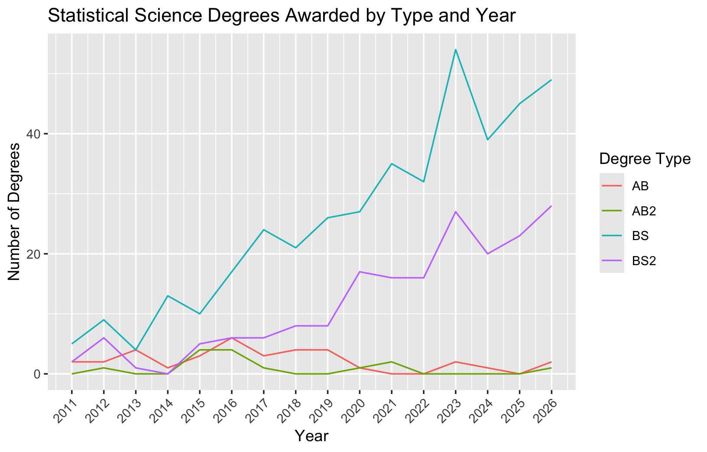

```{r}
#| message: false
#| echo: false
#| warning: false
#Load Packages and Data Preprocessing
library(tidyverse)
library(datasauRus)

```


# Why do we visualize?

The `datasauRus` R package is a modern extension of Anscombe's quartet, a famous example used in introductory statistics courses. We will explore why the datasets are so famous in this lab. 

In the dataset `datasaurus_dozen`, we have observations from 13 datasets, each of which contains 142 observations of two variables, $x$ and $y$.


# Exercise 1

The following code chunk calculates, for each of the 13 datasets, the following descriptive statistics for $x$ and $y$:  the mean, the standard deviation (square root of the variance), and the correlation between $x$ and $y$.  Run the code and comment on how these summary statistics vary across the groups (datasets).


```{r}
#| label: dozen-summary
#| eval: true

summdat <- datasaurus_dozen %>%
  group_by(dataset) %>%
  summarise(
    mean_x = mean(x),
    mean_y = mean(y),
    sd_x = sd(x),
    sd_y = sd(y),
    r = cor(x, y)
  )

print(summdat, n = 13)

```


# Exercise 2

Create a scatterplot of $y$ vs $x$, faceted by dataset (be sure to use informative labels - nicer plots get more points!). Then discuss how the plots compare across the datasets.  How does your response here compare to your response to Exercise 1?  What does this say about using summary statistics and data visualizations as tools when getting to know a dataset?

```{r}
#| label: dozen-plot
#| eval: false

ggplot(datasaurus_dozen, 
       aes()) +
  geom_point() +
  facet_wrap()

```

# Exercise 3: Global Life Expectancy

How has life expectancy from infancy changed over time around the world?

## Data

The data we're using originally come from the Institute for Health Metrics and Evaluation.

Let's  create a data visualization that displays how life expectancy in the US has changed over time for females, comparing it to life expectancy in India and Iran. Once we have that plot, you can change gender and countries, update colors, and format further as desired. We'll use a plot of statistics majors at Duke over time as a model.

We can easily change which countries are being plotted by changing which countries the code above `filter`s for. Note that the country name should be spelled and capitalized exactly the same way as it appears in the data. See the end of the file for a list of the countries in the data. 


# Target: Something Like This

```{r}
#| eval: false
ggplot(degrees_long, 
       aes(x = year, y = count, color = degree_type)) +
  geom_line() +
  labs(
    title = "Statistical Science Degrees Awarded by Type and Year",
    x = "Year",
    y = "Number of Degrees",
    color = "Degree Type"
  ) 
```

{width=50%}

or this...

```{r}
#| eval: false
ggplot(degrees_long, 
       aes(x = year, y = count, color = degree_type)) +
  geom_line() +
  labs(
    title = "Statistical Science Degrees Awarded by Type and Year",
    x = "Year",
    y = "Number of Degrees",
    color = "Degree Type"
  ) + scale_x_continuous(breaks = unique(degrees_long$year)) +
    theme(axis.text.x = element_text(angle = 45, hjust=1))
```    

{width=50%}

## Starting to Code

The data we're using originally come from the Institute for Health Metrics and Evaluation.

```{r}
#| label: load-data
#| 
library(tidyverse)
life <- readr::read_csv("lifeexp/lifeexpectancy_infant.csv")
head(life,10)


# we will learn more about the filter command shortly
# we use it to limit our data to 3 countries and female sex

life_3countries_f <- life %>%
  filter(
    location %in% c("United States of America", "India", "Iran (Islamic Republic of)"),
    sex == "Female"
  )


```

Let's start thinking about draft code! Fill in the missing pieces to make your plot, and time permitting, vary the countries and gender, or add some bells and whistles to make the plot more visually appealing.


```{r}
#| eval: false

ggplot(life_3countries_f, 
       aes()) +
  geom_line()

```


# Appendix {#appendix}
Below is a list of countries in the dataset:

```{r}
#| label: list-countries
#| echo: false
library(kableExtra)


life %>% 
  select(location) %>%
  arrange(location) %>% 
  distinct() %>%
  kbl(booktabs = TRUE, longtable = TRUE, col.names = "Country") %>%
  kable_styling(latex_options = c("striped", "repeat_header"))
```


